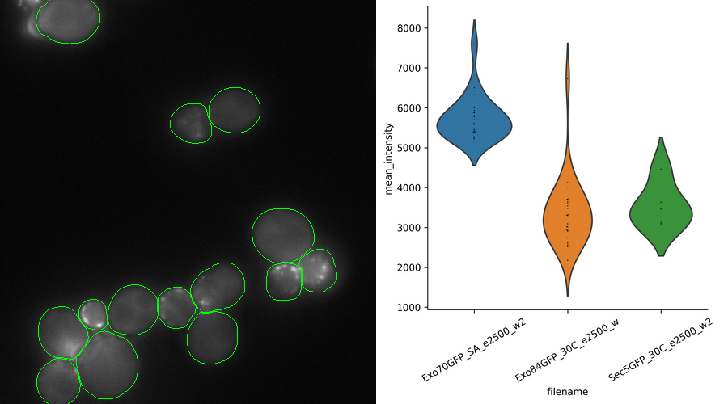

# Yeast fluorescent protein intensity pipeline to extract relative expression levels of proteins in yeast cells

This is a tool for processing of fluorescent microscopy images of yeast cells. This tool is based on neural network image segmentation from Alex Xijielu - YeastSpotter (https://github.com/alexxijielu/yeast_segmentation), <a href='https://doi.org/10.1093/bioinformatics/btz402'>scientific paper</a>. Set of functions from postprocess.py module extract data from single cells, such as mean pixel intensity and area.
Suitable for user-friendly high-throughput data extraction (mean intensity and area) following precise yeast cell segmentation by YeastSpotter. It can be used to estimate differences between relative protein expression from fluorescent images.

<h2>STEPS:</h2>
1. Clone <a href='https://github.com/alexxijielu/yeast_segmentation'>this repository</a>, and setup its dependencies to your environment, including downloading the weights 
2. Replace the opts.py file from YeastSpotter with an opts.py file in this repository, and add the postprocess.py and process.py to the same directory as the opts.py 
3. Setup a directory where will your analysis take place and the outputs will be saved (i.e. '/home/analysis/'). 
4. In this directory, create a directory called 'originals' and copy there your original images ('/home/analysis/originals/') 
5. Open file opts.py and specify path to the directory with the scripts (i.e. '/home/scripts/') and path to the directory with your analysis ('/home/analysis/'). 
6. In the opts.py file, specify parameters for processing and segmentation, and save it 
7. Run process.py file

<h2>This pipeline will:</h2>

1. Crop your images to desired size
2. Segment individual yeast cells (YeastSpotter) and output masks '/analysis/seg_out/masks/'
3. Match your images with masks for control of the segmentation output and save them to '/analysis/outlines/'
4. Removes edge touching objects from the mask to exclude them from te analysis
5. Measures the specified properties (see function measure_img in postprocess.py)
6. Plot the mean intensities per sample (violin plot)
8. Convert the area of the cells to square microns, and categorize them big/small to see the growth ratio (small cells are after division) to see whether they don't have a growth deffect
7. Save results in '/home/analysis/results/' (csv tables, png plot)

<h2>Example result plot + segmentation</h2>
</img>
Plot of mean intensities (observations = single cells of each sample).

<h2>Dependencies</h2>

Dependencies from <a href='https://github.com/alexxijielu/yeast_segmentation'>YeastSpotter</a> 
skimage 
pandas 
numpy 
cv2 
glob 
matplotlib 
PIL 
seaborn 

**Contact me to share with you the copy of the Anaconda environment used for this complete pipeline!**

<<<<<<< HEAD
yahooooo
=======
yahoo
>>>>>>> 7c768cfae158ddc589884ec8de5bb5a546f82115
